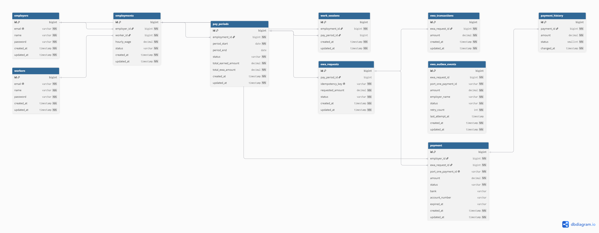

# WageClock — 급여 선지급 서비스

> 시간제 노동자의 분 단위 근태를 기록하고,
> 적립된 급여를 즉시 선지급할 수 있는 임금 인프라 서비스

---

## 배경

아르바이트·프리랜서·일용직 등 시간제 노동 현장에서는 두 가지 문제가 반복된다.

```
문제 1: 급여 분쟁
  근로시간이 구두·메신저에 의존해 기록됨
  → 퇴근 후 "얼마나 일했는가"가 해석의 영역이 됨

문제 2: 현금흐름 불일치
  소득은 월 1회, 지출은 매일 발생
  → 이미 일한 만큼의 급여에 접근할 수 없음
```

→ 분 단위 근태 기록 + 적립 급여 선지급으로 두 문제를 동시에 해결한다.

---

## 핵심 기능

```
출근 → 급여시계 시작 (분 단위 적립)
퇴근 → 급여 확정
선지급 요청 → 근무 중/퇴근 후 모두 가능, 적립액의 30% 한도 내에서 즉시 지급
정산 → PayPeriod close, 실지급 월급 계산 (totalEarnedAmount - totalEwaAmount)
고용주 대시보드 → 직원별 최신 근무 현황 실시간 조회 (JdbcTemplate DISTINCT ON)
PayPeriod 요약 → 근로자/고용주 모두 조회 가능, 진행 중 세션 실시간 반영
고용 이력 타임라인 → PayPeriod/WorkSession/EWA 이벤트를 시간순으로 조회
일괄 정산 → 고용주 정산 버튼 한 번으로 직원 N명 동시 송금 (Mock 헥토파이낸셜 펌뱅킹)
```

---

## 기술적 도전

```
선지급 중복 요청 방지  → 멱등성 (Idempotency Key)
동시 선지급 요청 제어  → 분산 락 (Redisson) + Pessimistic Lock (DB 레벨)
EWA 직접 펌뱅킹        → 고용주 승인 즉시 펌뱅킹 이체, VTIM/UNKNOWN 상태 관리
                          Scheduler가 주기적으로 미결 이체 재조회 후 상태 반영
EWA 재이체 (Outbox)    → 타행이체불능 수신 시 EwaTransferFailureOutBoxEvent 생성
                          Scheduler가 자동 재이체 후 결과에 따라 상태 전이
가상계좌 결제 연동     → PortOne V2 REST API (일괄 정산 전용 - 가상계좌 발급 + 웹훅 수신)
PG사 교체 가능 구조    → VirtualAccountPort / WageTransferPort 인터페이스 분리 (Hexagonal Architecture)
외부 API 트랜잭션 분리 → DB 커넥션 풀 고갈 방지를 위해 외부 API 호출과 @Transactional 분리
                          Processor 내부에서 엔티티 재조회로 detached 엔티티 문제 해결
장애복구 (Outbox 패턴) → 펌뱅킹 이체 실패 시 Scheduler 기반 자동 재시도
                          (Kafka Consumer로 교체 가능한 구조로 설계)
일괄 정산 병렬 처리    → CompletableFuture + ExecutorService로 직원 N명 동시 이체
                          이체 결과를 Sealed Interface로 타입 안전하게 분기 처리
타행이체불능 재시도    → 펌뱅킹 실패 통보 수신 시 Outbox 패턴으로 자동 재이체
```

---

## 결제 플로우

```
근로자 EWA 요청 (특정 금액)
  → 선지급 가능 금액 검증 (적립액 × 30% 한도 내)
  → PENDING 상태로 요청 저장
  → 고용주 승인 (initiateEwa)
  → EwaTransfer 생성 후 직접 펌뱅킹 이체
       ├─ 성공 (transferId 수신)   → EwaRequest APPROVED, EwaTransfer COMPLETED
       ├─ VTIM (pendingMessageNo)   → EwaTransfer PENDING_INQUIRY, Scheduler가 주기적으로 재조회
       ├─ 확정 실패 (failureReason) → EwaTransfer FAILED (잔액부족 등, 재시도 없음 / 운영팀 수동 처리)
       └─ 예외 (네트워크 오류 등)   → EwaTransfer UNKNOWN, Scheduler가 재조회

타행이체불능 수신 시 (전문번호 3000)
  → EwaTransfer RETRYING, EwaRequest APPROVED 유지 (승인 사실 불변)
  → PayPeriod.totalEwaAmount 즉시 환원 (선지급 한도 복구)
  → EwaTransferFailureOutBoxEvent 생성
  → Scheduler가 재이체
       ├─ 성공   → EwaTransfer COMPLETED, PayPeriod.totalEwaAmount 재차감
       ├─ VTIM   → EwaTransfer PENDING_INQUIRY, OutBoxEvent PROCESSED
       ├─ 확정실패 → EwaTransfer FAILED (운영팀 수동 처리)
       └─ MAX_RETRY 초과 → OutBoxEvent FAILED, EwaTransfer UNKNOWN (운영팀 알림 TODO)
```

---

## 정산 플로우

```
고용주 정산 요청
  → ACTIVE PayPeriod 조회
  → WORKING / PAUSED 세션 존재 시 정산 불가
  → PayPeriod CLOSED (periodEnd = 정산일)
  → 실지급 월급 계산 (totalEarnedAmount - totalEwaAmount)
  → 새 PayPeriod 자동 생성 (다음 사이클 시작)
```

---

## 일괄 정산 플로우

```
고용주 일괄 정산 요청 (직원 N명 선택)
  → ACTIVE PayPeriod N개 조회 (비관적 락)
  → 중복 정산 방지 체크
  → BulkSettlement 생성 → PortOne 가상계좌 발급 (Outbox 패턴으로 장애복구)
  → 고용주 가상계좌 입금
  → PortOne 웹훅 수신 (Transaction.Paid)
  → CompletableFuture로 N명 동시 펌뱅킹 이체
       ├─ 성공 → transferId 저장, PayPeriod CLOSED
       ├─ VTIM (응답 지연) → pendingMessageNo 저장, 이후 재조회
       └─ 실패 → Outbox 패턴으로 자동 재이체
  → 전원 성공 시 BulkSettlement COMPLETED
  → 일부 실패 시 TRANSFER_FAILED → Scheduler가 주기적으로 재시도

타행이체불능 수신 시 (전문번호 3000)
  → 해당 아이템 FAILED 처리
  → InterBankFailureOutBoxEvent 생성
  → Scheduler가 재이체 후 성공 시 COMPLETED
```

> 더 자세한 시퀀스/상태 다이어그램: [시퀀스 다이어그램](docs/diagrams/sequence-diagram.md) · [상태전이 다이어그램](docs/diagrams/state-diagram.md)

---

## 도메인 모델

```
Employer (고용주)
  └─ Employment (고용 관계) ── Worker (근로자)
       └─ PayPeriod (월 단위 정산 기간)
            └─ WorkSession (근무 세션 / 급여시계)
            └─ EwaRequest (선지급 요청)
                 └─ EwaTransfer (펌뱅킹 이체)
                      └─ EwaTransferFailureOutBoxEvent (재이체 Outbox)
```

## ERD



### 비즈니스 규칙

```
선지급 한도:     (PayPeriod 적립액 + PAUSED 세션 적립액) × 30%
선지급 잔액:     한도 - totalEwaAmount (누적 선지급액)
실제 지급 월급:  확정 번 돈 - totalEwaAmount (월급 정산 시)
Worker는 여러 사업장에 동시 고용 가능 (Employment로 관리)
```

### 계산 시점 정리

| 항목 | 계산 시점 | 계산 방법 |
|------|-----------|-----------|
| **현재 번 돈** | EWA 요청할 때마다 | PAUSED면 스냅샷 반환, WORKING이면 `lastResumeAt` 기준 누적 |
| **확정 번 돈** | 퇴근(clockOut) 시 | 퇴근 시점의 현재 번 돈을 WorkSession에 저장 |
| **PayPeriod.totalEarnedAmount** | 퇴근(clockOut) 시에만 누적 | `+ WorkSession.earnedAmount` |
| **선지급 한도** | EWA 요청할 때마다 | `(totalEarnedAmount + PAUSED 세션 적립액) × 30% - totalEwaAmount` |
| **totalEwaAmount** | EWA 요청 시 증가 | `+ requestedAmount` |
| **totalEwaAmount** | EWA 거절 / 이체 실패 시 감소 | `- requestedAmount` |
| **실제 지급 월급** | 월급 정산 시 (PayPeriod close) | `확정 번 돈 - totalEwaAmount` |
| **EWA 펌뱅킹 이체** | 고용주 승인(initiateEwa) 즉시 | Mock 펌뱅킹 API 호출, 결과에 따라 상태 전이 |

---

## 기술 스택

| 항목 | 내용 |
|------|------|
| **언어** | Java 21 |
| **프레임워크** | Spring Boot 3.5 |
| **데이터베이스** | PostgreSQL 16 |
| **ORM** | Spring Data JPA (Hibernate) |
| **인증** | JWT |
| **결제** | PortOne V2 (가상계좌 실연동) + Mock 송금 |
| **분산 락** | Redis (Redisson) |  
| **인프라** | Docker |
| **빌드** | Gradle |

---

## 로드맵

```
✅ Phase 1: 프로젝트 세팅 (Spring Boot + PostgreSQL + JWT)
✅ Phase 2: 엔티티 설계 (Employer / Worker / Employment / WorkSession / EwaRequest)
✅ Phase 3: JWT 인증 (회원가입 / 로그인)
✅ Phase 4: 근무 세션 API (출근 / 퇴근 / 일시정지 / 재개 / 급여 계산)
✅ Phase 5: 선지급 API (멱등성)
✅ Phase 5.5: Redis 연동 (분산 락)
✅ Phase 6: PG 인터페이스 설계
✅ Phase 7: Payment History 설계
✅ Phase 8: PortOne 가상계좌 연동 (발급 + 웹훅 수신)
✅ Phase 9: EwaTransaction 거래 내역 기록
✅ Phase 10: Outbox 패턴 (장애복구 - Scheduler 기반)
✅ Phase 11: 정산 API (PayPeriod close + 실지급 월급 계산 + 새 PayPeriod 생성)
✅ Phase 12: 고용주 대시보드 + PayPeriod 요약 + 고용 이력 타임라인 (JdbcTemplate)
✅ Phase 13: 일괄 정산 (Mock 헥토파이낸셜 펌뱅킹 병렬 처리 + Outbox 재시도)
✅ Phase 14: EWA 리팩토링 (PortOne 가상계좌 제거 → 직접 펌뱅킹 이체 + VTIM/UNKNOWN 상태 관리 + RETRYING 분리 + Outbox 재이체)
✅ Phase 15: Settlement 리팩토링 (VTIM/UNKNOWN 상태 관리 + RETRYING 분리 + Outbox 재이체)
✅ Phase 16: messageNo 사전생성 + RETRYING·UNKNOWN 통합 구조 (EWA·Bulk 공통 패턴으로 추출)
✅ Phase 17: 네이밍 정리 (도메인 용어 통일 — 메서드·상태·이벤트명 일관성 확보)
✅ Phase 18: Swagger / OpenAPI 문서화 (springdoc-openapi, 전체 API 엔드포인트 명세)
✅ Phase 19: BulkSettlement 리팩토링 (이체 결과를 Sealed Interface로 타입 안전하게 분기, prepareTransfer 실패 → Retryable, 타임아웃을 개별 future로 이동, 워커 분류 버그 수정)
✅ Phase 20: EWA Transfer 리팩토링 (prepareTransfer 실패 → FAILED 분리, inquiryTransfer else절 추가, Outbox terminal state early exit으로 이중송금 방지)
✅ Phase 21: Outbox 리팩토링 (try-catch 분리로 issueMessageNo 실패 버그 수정, Processor 패턴으로 @Transactional 경계 분리, classify()로 결과 분기 캡슐화)
✅ Phase 22: JPA 더티 체킹 활용 (트랜잭션 내 불필요한 repository.save() 제거)
✅ Phase 23: history cursor 기반 조회 구현
⬜ Phase 24: AWS 배포
⬜ Phase 24: React + TypeScript 프론트엔드 (핵심 플로우 동작 중심)
```

---

## 수익 모델

```
선지급 건당 수수료 (근로자 부담)
고용주는 무료로 선지급 인프라를 제공받고,
근로자는 월급날 전에 적립 급여에 즉시 접근하는 대신 소액 수수료 부담
```

---

## 고도화 방향

```
일괄 정산 (펌뱅킹)
  고용주 정산 버튼 한 번 → 직원 N명 실지급 월급 동시 송금
  각 직원별 (totalEarnedAmount - totalEwaAmount) 계산 → 펌뱅킹 API 병렬 처리
  실패 건만 Outbox 패턴으로 자동 재시도

정산 명세서
  날짜별 근무 시간 (clockIn / clockOut / pause 이력)
  EWA 선지급 내역 + 거절/실패 사유
  최종 실지급 금액 산출 근거
  → 근로자 / 고용주 양측이 같은 데이터를 보는 구조로 급여 분쟁 방지

EWA 방식 피벗
  선지급이 법적으로 제한될 경우 EwaPort 인터페이스 교체로
  급여 담보 대출 방식으로 전환 가능
  근태 기록 + 정산 명세서 코어는 EWA 없이도 독립 서비스로 동작
```

---

## 브랜치 전략

```
main    → 배포 가능한 최종 브랜치
feature → 기능 단위 개발 브랜치 (feature/xxx → dev PR)
```