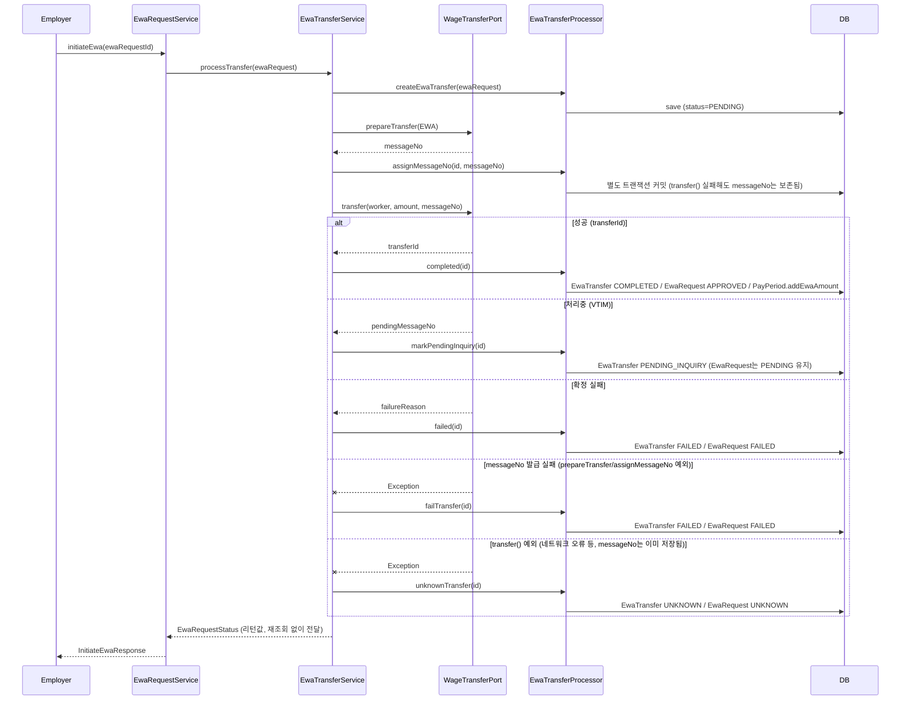
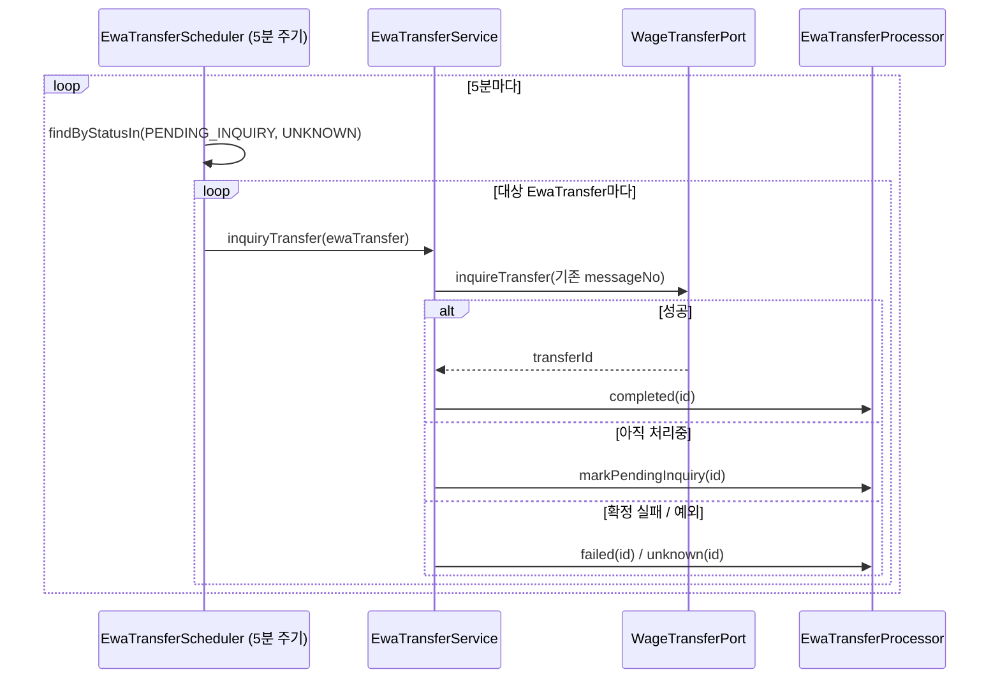
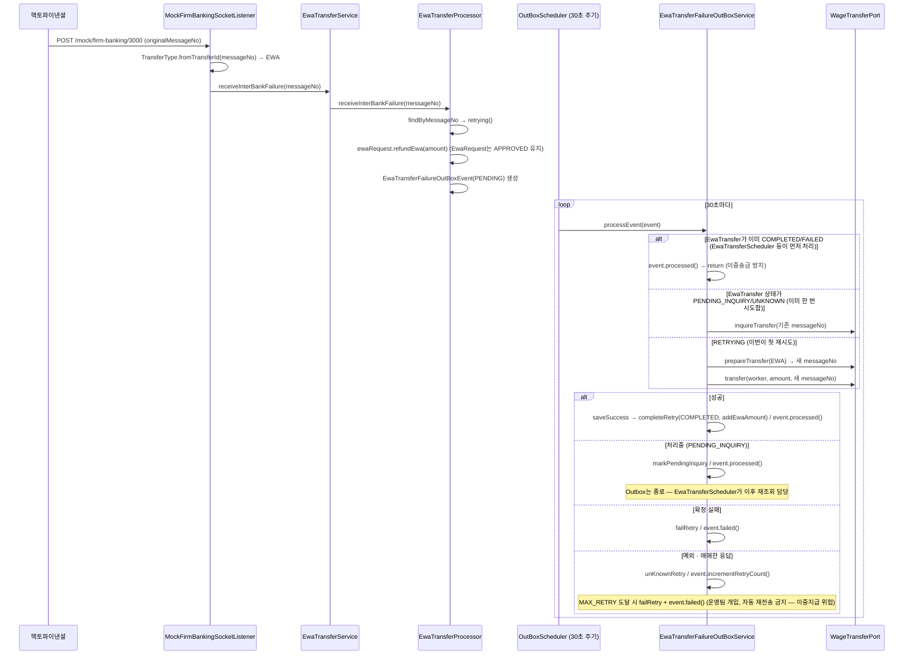
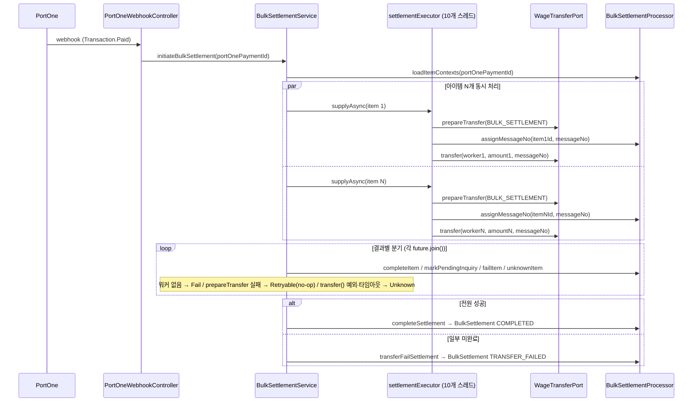
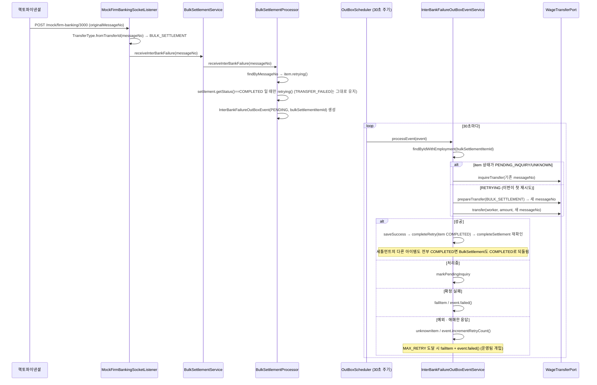

# 시퀀스 다이어그램

EWA(선지급)와 일괄 정산(Bulk Settlement)은 같은 구조(메시지노우 사전생성 + RETRYING/UNKNOWN)를 공유한다.
EWA는 단건/동기 처리, Bulk는 N건/병렬 처리라는 차이만 있다.

---

## 1. EWA — 최초 이체 시도 (initiateEwa)

> `prepareTransfer()`로 받은 messageNo를 `transfer()` 호출 **전에** 별도 트랜잭션으로 먼저 커밋해두는 게 핵심이다.
> `transfer()`가 예외를 던져도 messageNo는 이미 저장돼 있어 UNKNOWN 상태도 나중에 재조회로 복구할 수 있다.

---

## 2. EWA — 전역 스케줄러 (PENDING_INQUIRY / UNKNOWN 재조회)

`EwaTransferFailureOutBoxEvent`가 없는 건(=첫 시도에서 바로 VTIM/예외가 난 건)을 책임지는 유일한 경로.

---

## 3. EWA — 타행이체불능 수신 → Outbox 재시도

---

## 4. Bulk — 일괄 정산 최초 시도 (병렬 처리)

> `BulkSettlementScheduler.retryFailedTransfers`(5분 주기)가 `TRANSFER_FAILED` 세틀먼트를 다시 집어서
> `retrySettlement`(PENDING_INQUIRY/UNKNOWN 재조회 → 남은 PENDING/FAILED 재시도)를 호출한다.
> Bulk는 EWA처럼 항목 전체를 긁는 전역 스케줄러가 없는 대신, 이 세틀먼트 상태를 게이트로 같은 역할을 한다.

---

## 5. Bulk — 타행이체불능 수신 → Outbox 재시도

