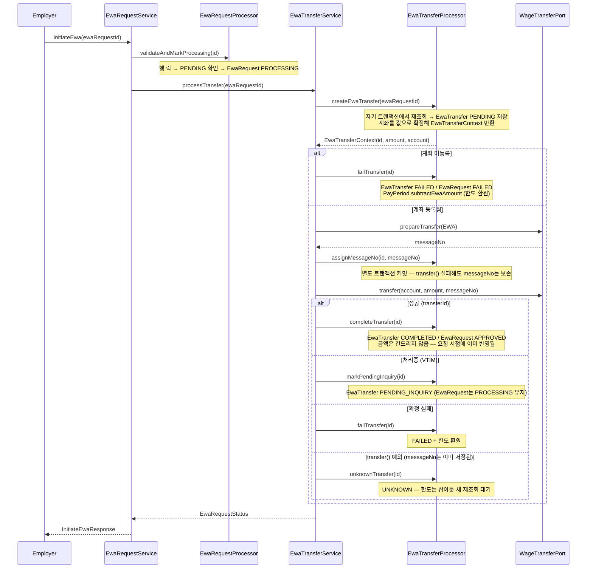
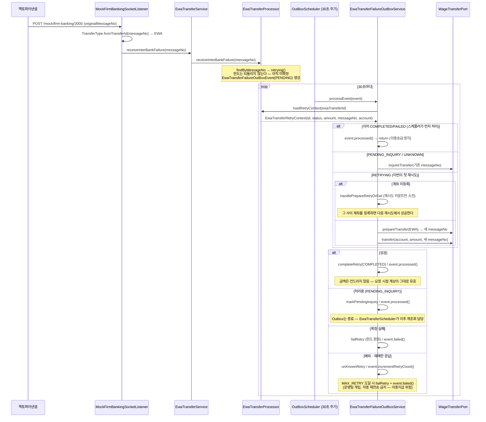
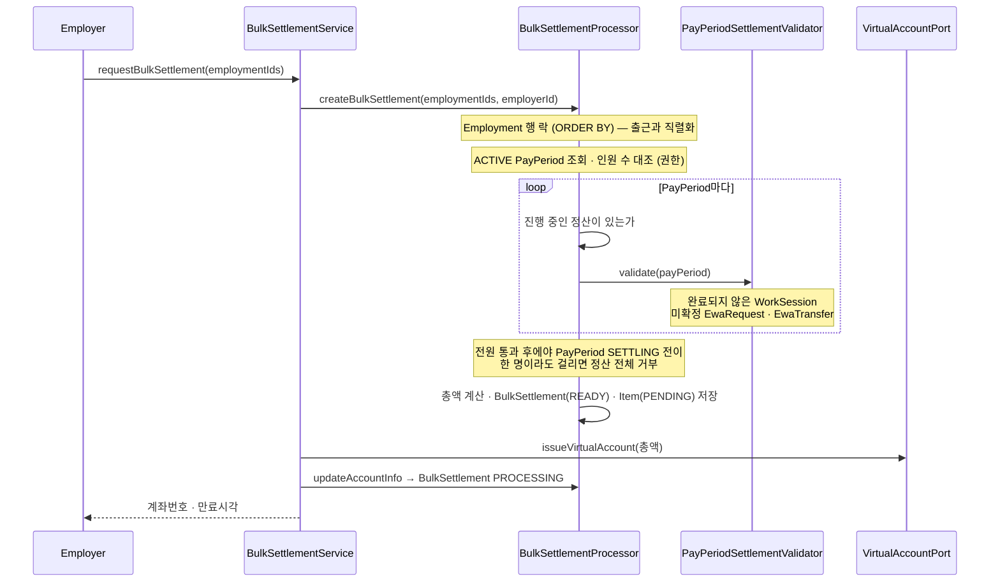
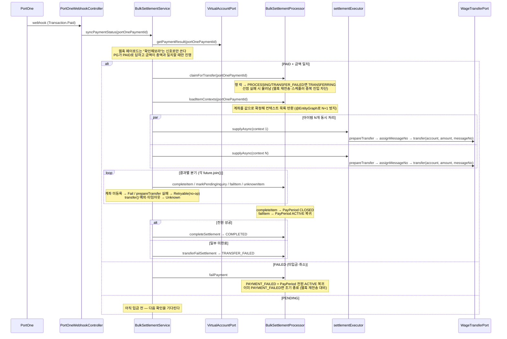
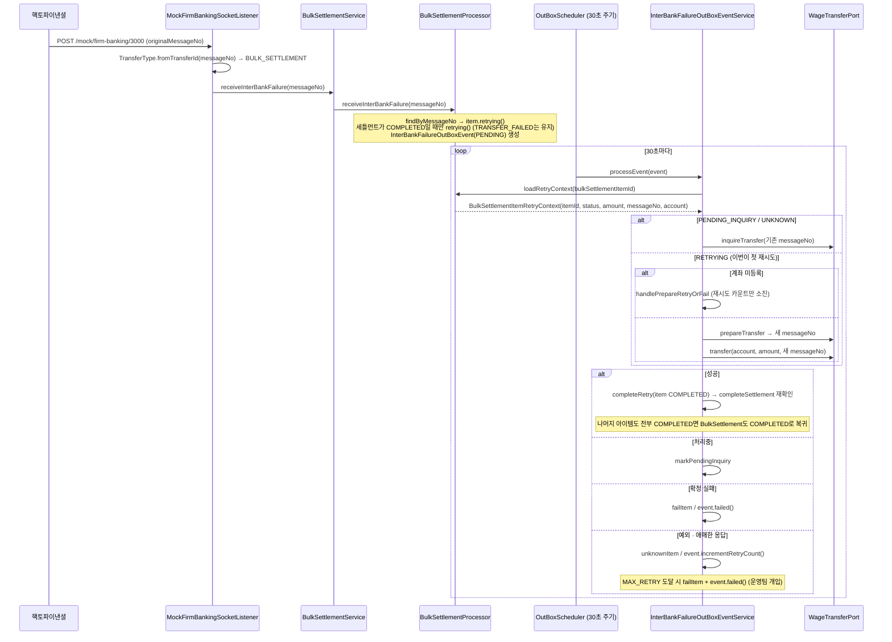

# 시퀀스 다이어그램

EWA(선지급)와 일괄 정산(Bulk Settlement)은 같은 구조(전문번호 사전생성 + RETRYING/UNKNOWN)를 공유한다.
EWA는 단건/동기 처리, Bulk는 N건/병렬 처리라는 차이만 있다.

두 경로 모두 **이체에 필요한 값은 트랜잭션 안에서 컨텍스트로 확정해 넘긴다.** 펌뱅킹 호출은
최대 수십 초라 트랜잭션 안에 둘 수 없고, 엔티티를 넘기면 영속성 컨텍스트가 닫힌 뒤에
연관관계를 타게 되기 때문이다.

---

## 1. EWA — 최초 이체 시도 (initiateEwa)

```mermaid
sequenceDiagram
    participant Employer
    participant EwaRequestService
    participant EwaRequestProcessor
    participant EwaTransferService
    participant EwaTransferProcessor
    participant WageTransferPort

    Employer->>EwaRequestService: initiateEwa(ewaRequestId)
    EwaRequestService->>EwaRequestProcessor: validateAndMarkProcessing(id)
    Note over EwaRequestProcessor: 행 락 → PENDING 확인 → EwaRequest PROCESSING

    EwaRequestService->>EwaTransferService: processTransfer(ewaRequestId)
    EwaTransferService->>EwaTransferProcessor: createEwaTransfer(ewaRequestId)
    Note over EwaTransferProcessor: 자기 트랜잭션에서 재조회 → EwaTransfer PENDING 저장<br/>계좌를 값으로 확정해 EwaTransferContext 반환
    EwaTransferProcessor-->>EwaTransferService: EwaTransferContext(id, amount, account)

    alt 계좌 미등록
        EwaTransferService->>EwaTransferProcessor: failTransfer(id)
        Note over EwaTransferProcessor: EwaTransfer FAILED / EwaRequest FAILED<br/>PayPeriod.subtractEwaAmount (한도 환원)
    else 계좌 등록됨
        EwaTransferService->>WageTransferPort: prepareTransfer(EWA)
        WageTransferPort-->>EwaTransferService: messageNo
        EwaTransferService->>EwaTransferProcessor: assignMessageNo(id, messageNo)
        Note over EwaTransferProcessor: 별도 트랜잭션 커밋 — transfer() 실패해도 messageNo는 보존

        EwaTransferService->>WageTransferPort: transfer(account, amount, messageNo)

        alt 성공 (transferId)
            EwaTransferService->>EwaTransferProcessor: completeTransfer(id)
            Note over EwaTransferProcessor: EwaTransfer COMPLETED / EwaRequest APPROVED<br/>금액은 건드리지 않음 — 요청 시점에 이미 반영됨
        else 처리중 (VTIM)
            EwaTransferService->>EwaTransferProcessor: markPendingInquiry(id)
            Note over EwaTransferProcessor: EwaTransfer PENDING_INQUIRY (EwaRequest는 PROCESSING 유지)
        else 확정 실패
            EwaTransferService->>EwaTransferProcessor: failTransfer(id)
            Note over EwaTransferProcessor: FAILED + 한도 환원
        else transfer() 예외 (messageNo는 이미 저장됨)
            EwaTransferService->>EwaTransferProcessor: unknownTransfer(id)
            Note over EwaTransferProcessor: UNKNOWN — 한도는 잡아둔 채 재조회 대기
        end
    end

    EwaTransferService-->>EwaRequestService: EwaRequestStatus
    EwaRequestService-->>Employer: InitiateEwaResponse
```

> `prepareTransfer()`로 받은 messageNo를 `transfer()` 호출 **전에** 별도 트랜잭션으로 먼저 커밋해두는 게 핵심이다.
> `transfer()`가 예외를 던져도 messageNo는 이미 저장돼 있어 `UNKNOWN` 상태도 나중에 재조회로 복구할 수 있다.
> 반대로 발급 자체가 실패하면 은행에 요청이 나가지 않았으므로 조회할 번호가 없고, 확정 실패로 떨어뜨린다.

---

## 2. EWA — 전역 스케줄러 (PENDING_INQUIRY / UNKNOWN 재조회)

`EwaTransferFailureOutBoxEvent`가 없는 건(=첫 시도에서 바로 VTIM/예외가 난 건)을 책임지는 유일한 경로.

```mermaid
sequenceDiagram
    participant Scheduler as EwaTransferScheduler (5분 주기)
    participant EwaTransferProcessor
    participant EwaTransferService
    participant WageTransferPort

    loop 5분마다
        Scheduler->>EwaTransferProcessor: loadInquiryContexts()
        Note over EwaTransferProcessor: PENDING_INQUIRY·UNKNOWN을 (id, messageNo)로 뽑는다<br/>조회는 계좌가 필요 없다
        EwaTransferProcessor-->>Scheduler: List&lt;EwaTransferInquiryContext&gt;

        loop 대상마다
            Scheduler->>EwaTransferService: inquiryTransfer(context)
            EwaTransferService->>WageTransferPort: inquireTransfer(기존 messageNo)
            alt 성공
                EwaTransferService->>EwaTransferProcessor: completeTransfer(id)
            else 아직 처리중
                EwaTransferService->>EwaTransferProcessor: markPendingInquiry(id)
            else 확정 실패
                EwaTransferService->>EwaTransferProcessor: failTransfer(id)
            else 예외 · 애매한 응답
                EwaTransferService->>EwaTransferProcessor: unknownTransfer(id)
            end
        end
    end
```

---

## 3. EWA — 타행이체불능 수신 → Outbox 재시도

```mermaid
sequenceDiagram
    participant Bank as 핵토파이낸셜
    participant Listener as MockFirmBankingSocketListener
    participant EwaTransferService
    participant EwaTransferProcessor
    participant OutboxScheduler as OutBoxScheduler (30초 주기)
    participant OutboxService as EwaTransferFailureOutBoxService
    participant WageTransferPort

    Bank->>Listener: POST /mock/firm-banking/3000 (originalMessageNo)
    Listener->>Listener: TransferType.fromTransferId(messageNo) → EWA
    Listener->>EwaTransferService: receiveInterBankFailure(messageNo)
    EwaTransferService->>EwaTransferProcessor: receiveInterBankFailure(messageNo)
    Note over EwaTransferProcessor: findByMessageNo → retrying()<br/>한도는 되돌리지 않는다 — 아직 미확정<br/>EwaTransferFailureOutBoxEvent(PENDING) 생성

    loop 30초마다
        OutboxScheduler->>OutboxService: processEvent(event)
        OutboxService->>EwaTransferProcessor: loadRetryContext(ewaTransferId)
        EwaTransferProcessor-->>OutboxService: EwaTransferRetryContext(id, status, amount, messageNo, account)

        alt 이미 COMPLETED/FAILED (스케줄러가 먼저 처리)
            OutboxService->>OutboxService: event.processed() → return (이중송금 방지)
        else PENDING_INQUIRY / UNKNOWN
            OutboxService->>WageTransferPort: inquireTransfer(기존 messageNo)
        else RETRYING (이번이 첫 재시도)
            alt 계좌 미등록
                OutboxService->>OutboxService: handlePrepareRetryOrFail (재시도 카운트만 소진)
                Note over OutboxService: 그 사이 계좌를 등록하면 다음 재시도에서 성공한다
            else
                OutboxService->>WageTransferPort: prepareTransfer(EWA) → 새 messageNo
                OutboxService->>WageTransferPort: transfer(account, amount, 새 messageNo)
            end
        end

        alt 성공
            OutboxService->>OutboxService: completeRetry(COMPLETED) / event.processed()
            Note over OutboxService: 금액은 건드리지 않음 — 요청 시점 계상이 그대로 유효
        else 처리중 (PENDING_INQUIRY)
            OutboxService->>OutboxService: markPendingInquiry / event.processed()
            Note over OutboxService: Outbox는 종료 — EwaTransferScheduler가 이후 재조회 담당
        else 확정 실패
            OutboxService->>OutboxService: failRetry (한도 환원) / event.failed()
        else 예외 · 애매한 응답
            OutboxService->>OutboxService: unKnownRetry / event.incrementRetryCount()
            Note over OutboxService: MAX_RETRY 도달 시 failRetry + event.failed()<br/>(운영팀 개입, 자동 재전송 금지 — 이중지급 위험)
        end
    end
```

---

## 4. Bulk — 정산 요청 (가상계좌 발급까지)

```mermaid
sequenceDiagram
    participant Employer
    participant BulkSettlementService
    participant BulkSettlementProcessor
    participant Validator as PayPeriodSettlementValidator
    participant VirtualAccountPort

    Employer->>BulkSettlementService: requestBulkSettlement(employmentIds)
    BulkSettlementService->>BulkSettlementProcessor: createBulkSettlement(employmentIds, employerId)

    Note over BulkSettlementProcessor: Employment 행 락 (ORDER BY) — 출근과 직렬화
    Note over BulkSettlementProcessor: ACTIVE PayPeriod 조회 · 인원 수 대조 (권한)

    loop PayPeriod마다
        BulkSettlementProcessor->>BulkSettlementProcessor: 진행 중인 정산이 있는가
        BulkSettlementProcessor->>Validator: validate(payPeriod)
        Note over Validator: 완료되지 않은 WorkSession<br/>미확정 EwaRequest · EwaTransfer
    end

    Note over BulkSettlementProcessor: 전원 통과 후에야 PayPeriod SETTLING 전이<br/>한 명이라도 걸리면 정산 전체 거부

    BulkSettlementProcessor->>BulkSettlementProcessor: 총액 계산 · BulkSettlement(READY) · Item(PENDING) 저장
    BulkSettlementService->>VirtualAccountPort: issueVirtualAccount(총액)
    BulkSettlementService->>BulkSettlementProcessor: updateAccountInfo → BulkSettlement PROCESSING
    BulkSettlementService-->>Employer: 계좌번호 · 만료시각
```

> 검증과 상태 전이를 나눈 것은 all-or-nothing을 코드에 드러내기 위해서다. 사장이 승인할 총액이
> 요청 목록 기준으로 계산되므로 일부만 빼고 진행할 수 없다.

---

## 5. Bulk — 입금 웹훅 → 병렬 이체

```mermaid
sequenceDiagram
    participant PortOne
    participant Controller as PortOneWebhookController
    participant BulkSettlementService
    participant VirtualAccountPort
    participant BulkSettlementProcessor
    participant Executor as settlementExecutor
    participant WageTransferPort

    PortOne->>Controller: webhook (Transaction.Paid)
    Controller->>BulkSettlementService: syncPaymentStatus(portOnePaymentId)

    BulkSettlementService->>VirtualAccountPort: getPaymentResult(portOnePaymentId)
    Note over BulkSettlementService: 웹훅 페이로드는 "확인해보라"는 신호로만 쓴다<br/>PG가 PAID로 답하고 금액이 총액과 일치할 때만 진행

    alt PAID + 금액 일치
        BulkSettlementService->>BulkSettlementProcessor: claimForTransfer(portOnePaymentId)
        Note over BulkSettlementProcessor: 행 락 → PROCESSING/TRANSFER_FAILED면 TRANSFERRING<br/>선점 실패 시 물러남 (웹훅 재전송·스케줄러 중복 진입 차단)

        BulkSettlementService->>BulkSettlementProcessor: loadItemContexts(portOnePaymentId)
        Note over BulkSettlementProcessor: 계좌를 값으로 확정해 컨텍스트 목록 반환 (@EntityGraph로 N+1 방지)

        par 아이템 N개 동시 처리
            BulkSettlementService->>Executor: supplyAsync(context 1)
            Executor->>WageTransferPort: prepareTransfer → assignMessageNo → transfer(account, amount, messageNo)
        and
            BulkSettlementService->>Executor: supplyAsync(context N)
            Executor->>WageTransferPort: prepareTransfer → assignMessageNo → transfer(account, amount, messageNo)
        end

        loop 결과별 분기 (각 future.join())
            BulkSettlementService->>BulkSettlementProcessor: completeItem / markPendingInquiry / failItem / unknownItem
            Note over BulkSettlementService: 계좌 미등록 → Fail / prepareTransfer 실패 → Retryable(no-op)<br/>transfer() 예외·타임아웃 → Unknown
        end
        Note over BulkSettlementProcessor: completeItem → PayPeriod CLOSED<br/>failItem → PayPeriod ACTIVE 복귀

        alt 전원 성공
            BulkSettlementService->>BulkSettlementProcessor: completeSettlement → COMPLETED
        else 일부 미완료
            BulkSettlementService->>BulkSettlementProcessor: transferFailSettlement → TRANSFER_FAILED
        end
    else FAILED (미입금·취소)
        BulkSettlementService->>BulkSettlementProcessor: failPayment
        Note over BulkSettlementProcessor: PAYMENT_FAILED + PayPeriod 전원 ACTIVE 복귀<br/>이미 PAYMENT_FAILED면 조기 종료 (웹훅 재전송 대비)
    else PENDING
        Note over BulkSettlementService: 아직 입금 전 — 다음 확인을 기다린다
    end
```

> **스케줄러 두 개가 이 흐름을 보완한다.** `retryMissedWebhook`은 `PROCESSING`을 훑어 웹훅 미수신을
> 메우고, `retryFailedTransfers`는 `TRANSFER_FAILED`를 다시 선점해 `retrySettlement`(미확정 조회 →
> 남은 PENDING 재이체)를 돌린다. `recoverStaleTransferring`은 이체 중 죽어 `TRANSFERRING`에 방치된
> 건을 회수한다.

---

## 6. Bulk — 타행이체불능 수신 → Outbox 재시도

```mermaid
sequenceDiagram
    participant Bank as 핵토파이낸셜
    participant Listener as MockFirmBankingSocketListener
    participant BulkSettlementService
    participant BulkSettlementProcessor
    participant OutboxScheduler as OutBoxScheduler (30초 주기)
    participant OutboxService as InterBankFailureOutBoxEventService
    participant WageTransferPort

    Bank->>Listener: POST /mock/firm-banking/3000 (originalMessageNo)
    Listener->>Listener: TransferType.fromTransferId(messageNo) → BULK_SETTLEMENT
    Listener->>BulkSettlementService: receiveInterBankFailure(messageNo)
    BulkSettlementService->>BulkSettlementProcessor: receiveInterBankFailure(messageNo)
    Note over BulkSettlementProcessor: findByMessageNo → item.retrying()<br/>세틀먼트가 COMPLETED일 때만 retrying() (TRANSFER_FAILED는 유지)<br/>InterBankFailureOutBoxEvent(PENDING) 생성

    loop 30초마다
        OutboxScheduler->>OutboxService: processEvent(event)
        OutboxService->>BulkSettlementProcessor: loadRetryContext(bulkSettlementItemId)
        BulkSettlementProcessor-->>OutboxService: BulkSettlementItemRetryContext(itemId, status, amount, messageNo, account)

        alt PENDING_INQUIRY / UNKNOWN
            OutboxService->>WageTransferPort: inquireTransfer(기존 messageNo)
        else RETRYING (이번이 첫 재시도)
            alt 계좌 미등록
                OutboxService->>OutboxService: handlePrepareRetryOrFail (재시도 카운트만 소진)
            else
                OutboxService->>WageTransferPort: prepareTransfer → 새 messageNo
                OutboxService->>WageTransferPort: transfer(account, amount, 새 messageNo)
            end
        end

        alt 성공
            OutboxService->>OutboxService: completeRetry(item COMPLETED) → completeSettlement 재확인
            Note over OutboxService: 나머지 아이템도 전부 COMPLETED면 BulkSettlement도 COMPLETED로 복귀
        else 처리중
            OutboxService->>OutboxService: markPendingInquiry
        else 확정 실패
            OutboxService->>OutboxService: failItem / event.failed()
        else 예외 · 애매한 응답
            OutboxService->>OutboxService: unknownItem / event.incrementRetryCount()
            Note over OutboxService: MAX_RETRY 도달 시 failItem + event.failed() (운영팀 개입)
        end
    end
```
