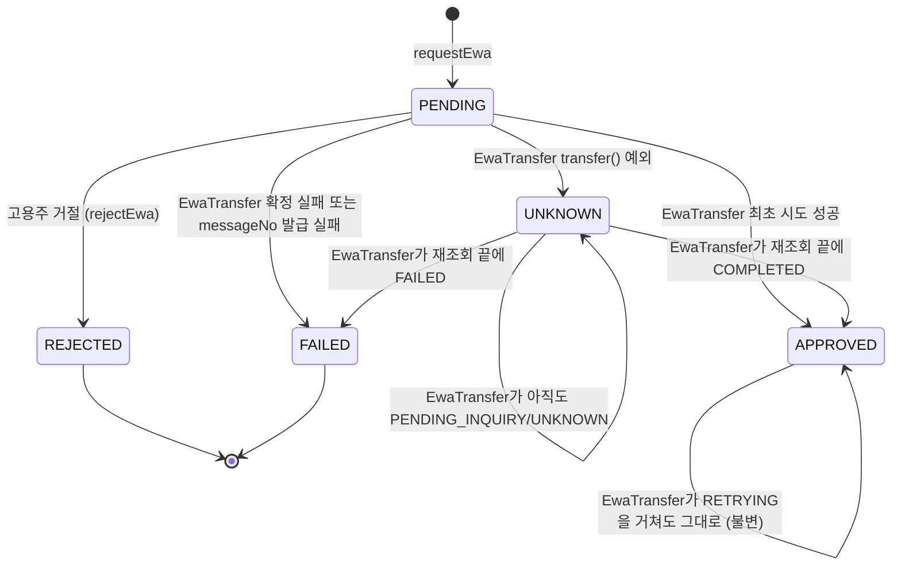
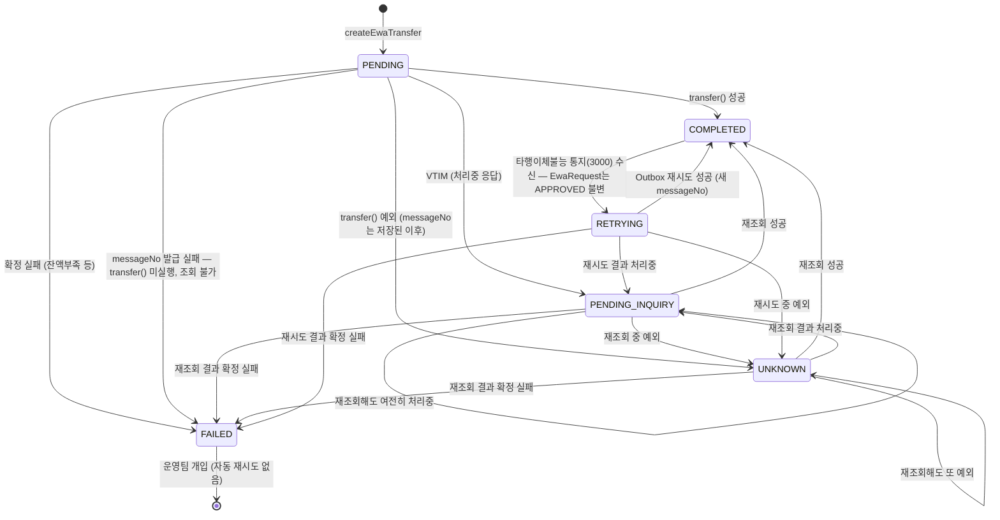
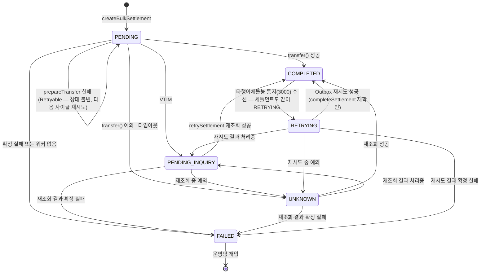
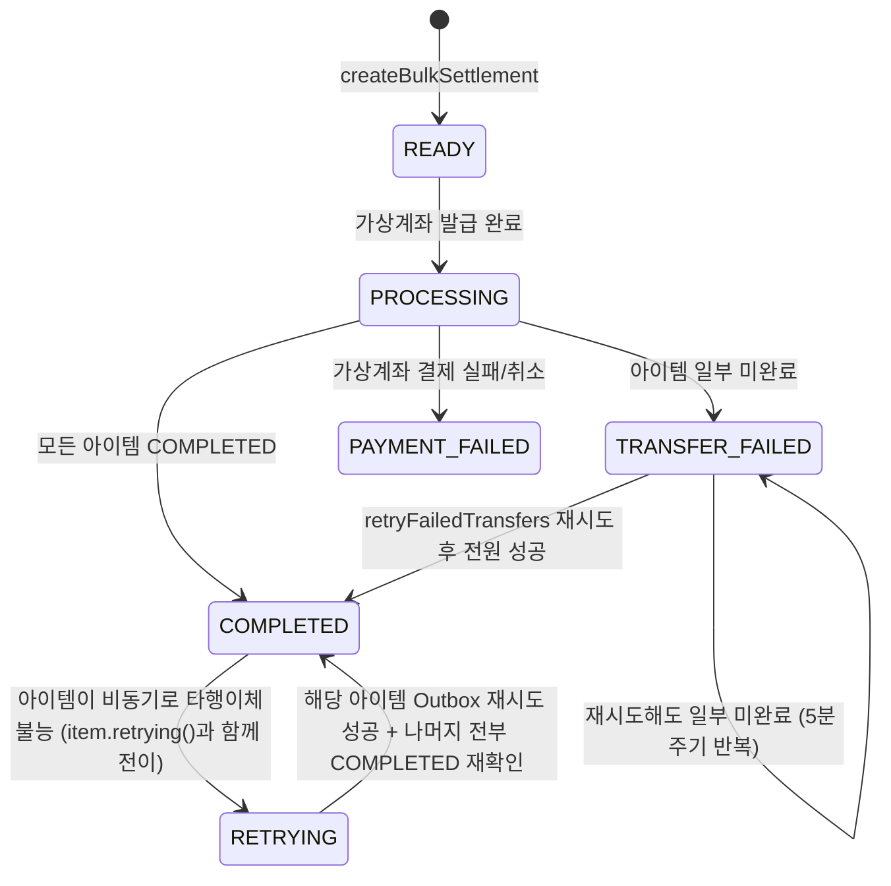

# 상태전이 다이어그램

## 1. EwaRequest

`EwaRequest`는 `EwaTransfer`의 모든 상태변화를 미러링하지 않는다 — `APPROVED`에 한 번 도달하면
그 뒤로 `EwaTransfer`가 비동기 `RETRYING`/재시도를 몇 번을 거치든 **불변**이다. "승인했다"는 사실 자체는
이체가 일시적으로 막혀도 바뀌지 않기 때문이다(대신 `PayPeriod.totalEwaAmount`가 환원/재차감으로 한도를 따라간다).

---

## 2. EwaTransfer

`EwaRequest`는 `EwaTransfer`의 상태를 그대로 미러링하지 않는다 — `APPROVED`가 된 이후(`COMPLETED` 도달)에는
`RETRYING`/재시도 결과와 무관하게 **불변**으로 유지된다(승인 사실 자체는 안 바뀜). `PayPeriod.totalEwaAmount`만
`RETRYING` 시 환원, 재시도 성공 시 재차감되어 한도 계산에 반영된다.

---

## 3. BulkSettlementItem

EWA와 거의 동일한 모양이다. 차이는 `PayPeriod.close()`인데, 이건 EWA의 `totalEwaAmount`처럼 환원 가능한
금액이 아니라 "1달 기간 종료"라는 도메인 사실이라 **단방향**이다 — `RETRYING`이 되어도 되돌리지 않고,
재시도 완료(`completeRetry`)도 `close()`를 다시 부르지 않는다(중복 호출 시 `periodEnd` 덮어쓰기 버그가 됨).

---

## 4. BulkSettlement (세틀먼트 레벨)

세틀먼트 레벨엔 `UNKNOWN`이 없다 — 아이템은 N개라 하나의 `UNKNOWN`을 세틀먼트 전체로 집계하는 게 의미가 없고
(EWA는 `EwaTransfer`:`EwaRequest`가 1:1이라 미러링이 자연스럽지만 Bulk는 1:N), 대신 `anyNotCompleted` 체크로
"전부 COMPLETED 아니면 TRANSFER_FAILED" 이분법만 쓴다.

`COMPLETED → RETRYING` 전이가 없으면, 이미 끝난 것처럼 보이는 세틀먼트의 PayPeriod에 대해
`createBulkSettlement`의 중복생성 가드가 새 정산을 또 만들 수 있는 구멍이 생긴다 — 이게 이 전이를 추가한 이유다.

`TRANSFER_FAILED → RETRYING`은 **의도적으로 없다** — `receiveInterBankFailure`에서 `settlement.getStatus() == COMPLETED`일 때만
`retrying()`을 호출하는 가드가 있어서, `TRANSFER_FAILED` 세틀먼트는 타행이체불능 통지를 받아도 상태가 바뀌지 않는다.
`TRANSFER_FAILED`는 이미 중복생성 가드의 안전 목록에 포함돼 있어 보호가 되기 때문이다.
