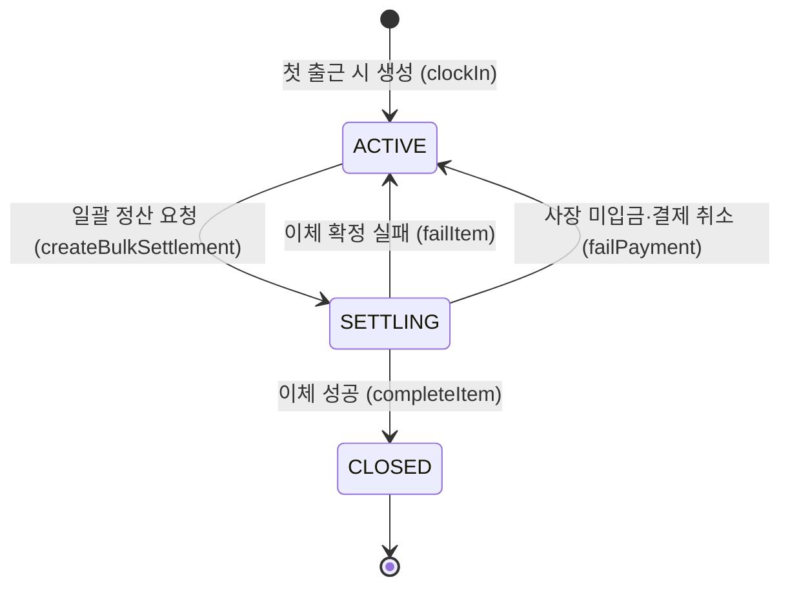
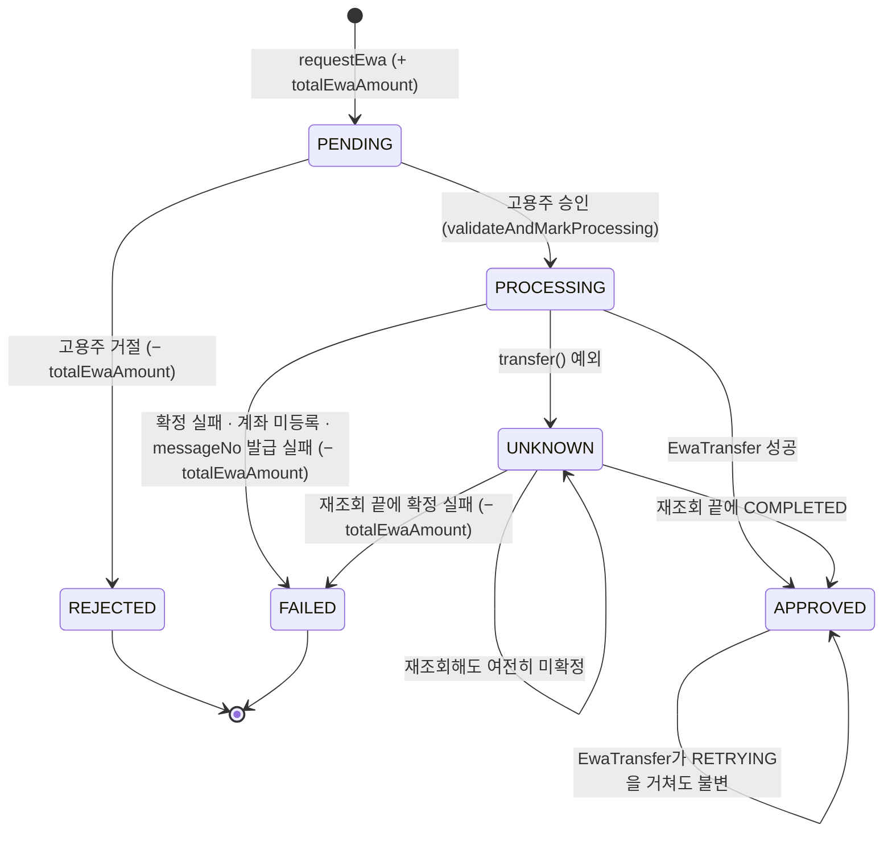
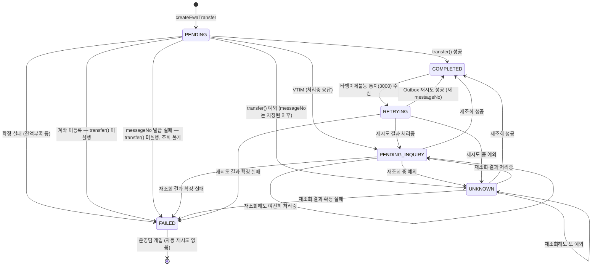
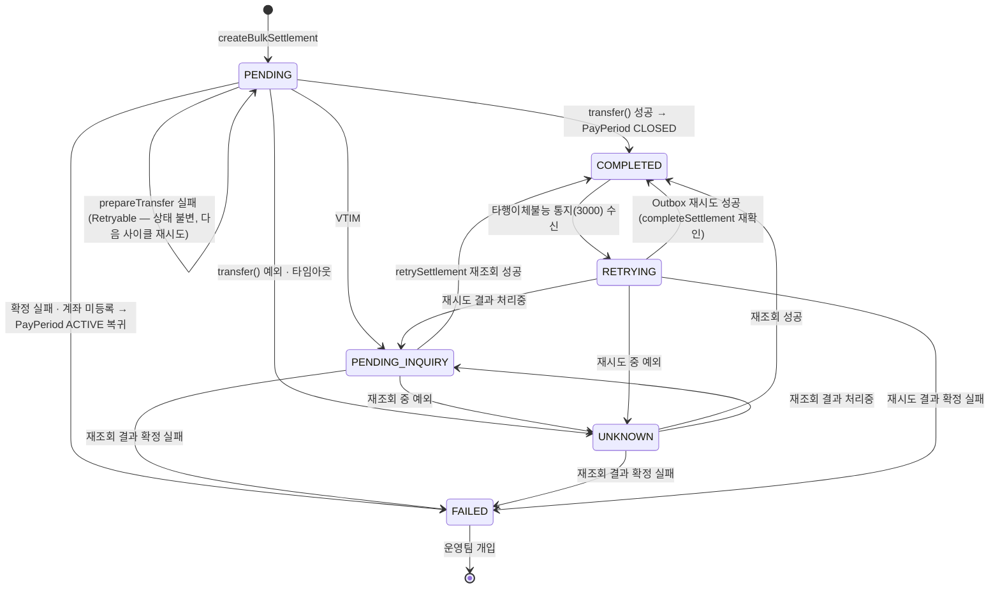
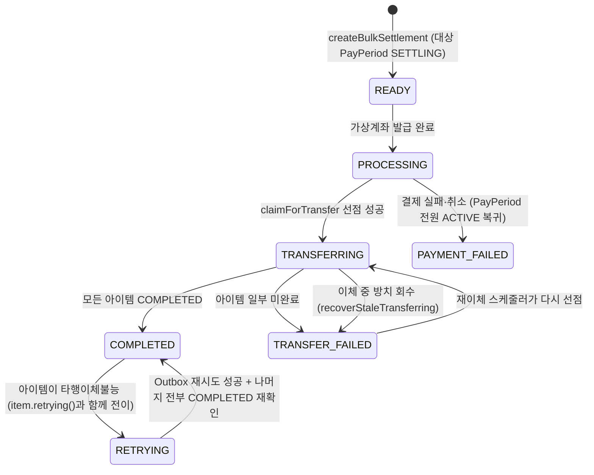

# 상태전이 다이어그램

## 0. 선지급 한도 계상 규칙

상태 전이를 읽기 전에 알아야 할 규칙이다. `PayPeriod.totalEwaAmount`는
**요청 시점에 한 번 더하고, 확정 실패일 때만 뺀다.**

| 지점 | 금액 |
|---|---|
| EWA 요청 (`processEwaRequest`) | `+ amount` |
| 거절 (`validateAndRejectEwa`) | `− amount` |
| 이체 확정 실패 (`failTransfer` · `failRetry`) | `− amount` |
| 이체 성공 | — (요청 시점에 이미 반영됨) |
| 타행이체불능(`RETRYING`) · `UNKNOWN` | — (미확정이므로 한도를 계속 잡아둔다) |

성공 시점에 더하면 결과를 모르는 구간에 한도가 비어 근로자가 한도를 초과해 요청할 수 있다.
미확정 구간에서 환원해버리면 재시도 성공 시 다시 더해야 하는데, 그러면 최초 성공 경로와
재시도 성공 경로가 같은 메서드를 공유하면서 한쪽이 반드시 틀어진다.

---

## 1. PayPeriod

```mermaid
stateDiagram-v2
    [*] --> ACTIVE: 첫 출근 시 생성 (clockIn)

    ACTIVE --> SETTLING: 일괄 정산 요청 (createBulkSettlement)

    SETTLING --> CLOSED: 이체 성공 (completeItem)
    SETTLING --> ACTIVE: 이체 확정 실패 (failItem)
    SETTLING --> ACTIVE: 사장 미입금·결제 취소 (failPayment)

    CLOSED --> [*]
```

정산 시작과 마감 사이는 **사장 입금을 기다리는 구간**이라 수 분~수 시간 열려 있다. 그동안
금액이 움직이면 이미 확정된 이체액(`BulkSettlementItem.amount`)과 어긋나므로, `SETTLING`으로
잠가 그 기간의 출근을 막는다. 락은 트랜잭션이 끝나면 풀려 이 구간을 덮을 수 없다.

**되돌리는 건 확정 실패뿐이다.** 미확정(`PENDING_INQUIRY` · `UNKNOWN`)에서 `ACTIVE`로 풀면
재정산 대상이 되어 이중 송금 위험이 생긴다.

정산 중에 새 PayPeriod를 만들지 않고 출근 자체를 막는 이유는, employment당 진행 중인
PayPeriod가 둘이 되면 `Optional` 조회들이 깨지고 실패 시 되돌릴 때 `ACTIVE`가 두 개가 되기
때문이다.

---

## 2. EwaRequest

```mermaid
stateDiagram-v2
    [*] --> PENDING: requestEwa (+ totalEwaAmount)

    PENDING --> REJECTED: 고용주 거절 (− totalEwaAmount)
    PENDING --> PROCESSING: 고용주 승인 (validateAndMarkProcessing)

    PROCESSING --> APPROVED: EwaTransfer 성공
    PROCESSING --> FAILED: 확정 실패 · 계좌 미등록 · messageNo 발급 실패 (− totalEwaAmount)
    PROCESSING --> UNKNOWN: transfer() 예외

    UNKNOWN --> APPROVED: 재조회 끝에 COMPLETED
    UNKNOWN --> FAILED: 재조회 끝에 확정 실패 (− totalEwaAmount)
    UNKNOWN --> UNKNOWN: 재조회해도 여전히 미확정

    APPROVED --> APPROVED: EwaTransfer가 RETRYING을 거쳐도 불변

    REJECTED --> [*]
    FAILED --> [*]
```

`EwaRequest`는 `EwaTransfer`의 상태를 미러링하지 않는다. `APPROVED`에 도달하면 그 뒤로
`EwaTransfer`가 `RETRYING`을 몇 번 거치든 **불변**이다 — "승인했다"는 사실은 이체가 일시적으로
막혀도 바뀌지 않는다.

---

## 3. EwaTransfer

```mermaid
stateDiagram-v2
    [*] --> PENDING: createEwaTransfer

    PENDING --> COMPLETED: transfer() 성공
    PENDING --> PENDING_INQUIRY: VTIM (처리중 응답)
    PENDING --> FAILED: 확정 실패 (잔액부족 등)
    PENDING --> FAILED: 계좌 미등록 — transfer() 미실행
    PENDING --> FAILED: messageNo 발급 실패 — transfer() 미실행, 조회 불가
    PENDING --> UNKNOWN: transfer() 예외 (messageNo는 저장된 이후)

    PENDING_INQUIRY --> COMPLETED: 재조회 성공
    PENDING_INQUIRY --> PENDING_INQUIRY: 재조회해도 여전히 처리중
    PENDING_INQUIRY --> FAILED: 재조회 결과 확정 실패
    PENDING_INQUIRY --> UNKNOWN: 재조회 중 예외

    UNKNOWN --> COMPLETED: 재조회 성공
    UNKNOWN --> PENDING_INQUIRY: 재조회 결과 처리중
    UNKNOWN --> FAILED: 재조회 결과 확정 실패
    UNKNOWN --> UNKNOWN: 재조회해도 또 예외

    COMPLETED --> RETRYING: 타행이체불능 통지(3000) 수신

    RETRYING --> COMPLETED: Outbox 재시도 성공 (새 messageNo)
    RETRYING --> PENDING_INQUIRY: 재시도 결과 처리중
    RETRYING --> FAILED: 재시도 결과 확정 실패
    RETRYING --> UNKNOWN: 재시도 중 예외

    FAILED --> [*]: 운영팀 개입 (자동 재시도 없음)
```

`FAILED`와 `UNKNOWN`을 가르는 기준은 **돈이 나갔는지 알 수 있는가**다. 전문번호가 발급되기
전에 실패했다면 은행에 요청 자체가 없었으므로 확정 실패고, 전문번호가 나간 뒤의 예외는
결과를 모르므로 `UNKNOWN`으로 두고 그 번호로 조회한다. 두 경로를 한 try-catch로 묶으면
발급 실패한 건이 없는 번호로 조회를 시도하게 된다.

---

## 4. BulkSettlementItem

```mermaid
stateDiagram-v2
    [*] --> PENDING: createBulkSettlement

    PENDING --> COMPLETED: transfer() 성공 → PayPeriod CLOSED
    PENDING --> PENDING_INQUIRY: VTIM
    PENDING --> FAILED: 확정 실패 · 계좌 미등록 → PayPeriod ACTIVE 복귀
    PENDING --> UNKNOWN: transfer() 예외 · 타임아웃
    PENDING --> PENDING: prepareTransfer 실패 (Retryable — 상태 불변, 다음 사이클 재시도)

    PENDING_INQUIRY --> COMPLETED: retrySettlement 재조회 성공
    PENDING_INQUIRY --> FAILED: 재조회 결과 확정 실패
    PENDING_INQUIRY --> UNKNOWN: 재조회 중 예외

    UNKNOWN --> COMPLETED: 재조회 성공
    UNKNOWN --> PENDING_INQUIRY: 재조회 결과 처리중
    UNKNOWN --> FAILED: 재조회 결과 확정 실패

    COMPLETED --> RETRYING: 타행이체불능 통지(3000) 수신

    RETRYING --> COMPLETED: Outbox 재시도 성공 (completeSettlement 재확인)
    RETRYING --> PENDING_INQUIRY: 재시도 결과 처리중
    RETRYING --> FAILED: 재시도 결과 확정 실패
    RETRYING --> UNKNOWN: 재시도 중 예외

    FAILED --> [*]: 운영팀 개입
```

EWA와 거의 같은 모양이다. 차이는 **아이템 단위로 PayPeriod가 닫힌다**는 점이다 —
이체가 성공한 근로자의 PayPeriod만 그 자리에서 `CLOSED`가 되고, 실패한 사람은 `ACTIVE`로
되돌아간다. "닫힘 = 지급됨"이 보장되므로 일부만 닫힌 중간 상태가 정상적으로 존재한다.

`RETRYING`이 되어도 `CLOSED`는 되돌리지 않는다. 마감은 환원 가능한 금액이 아니라
"기간 종료"라는 도메인 사실이고, 재시도가 성공하면 이미 닫힌 그 기간에 대한 지급이 완료되는
것이기 때문이다.

---

## 5. BulkSettlement (세틀먼트 레벨)

```mermaid
stateDiagram-v2
    [*] --> READY: createBulkSettlement (대상 PayPeriod SETTLING)
    READY --> PROCESSING: 가상계좌 발급 완료

    PROCESSING --> TRANSFERRING: claimForTransfer 선점 성공
    PROCESSING --> PAYMENT_FAILED: 결제 실패·취소 (PayPeriod 전원 ACTIVE 복귀)

    TRANSFERRING --> COMPLETED: 모든 아이템 COMPLETED
    TRANSFERRING --> TRANSFER_FAILED: 아이템 일부 미완료
    TRANSFERRING --> TRANSFER_FAILED: 이체 중 방치 회수 (recoverStaleTransferring)

    TRANSFER_FAILED --> TRANSFERRING: 재이체 스케줄러가 다시 선점
    COMPLETED --> RETRYING: 아이템이 타행이체불능 (item.retrying()과 함께 전이)
    RETRYING --> COMPLETED: Outbox 재시도 성공 + 나머지 전부 COMPLETED 재확인
```

### TRANSFERRING — 이체 선점

진입점이 셋(웹훅, 미수신 확인 스케줄러, 재이체 스케줄러)이라 같은 정산에 동시에 들어올 수
있다. 특히 웹훅은 응답이 늦으면 PG가 재전송하므로 중복 진입이 실제로 발생한다.

`claimForTransfer`가 행 락을 잡고 `PROCESSING`/`TRANSFER_FAILED`일 때만 `TRANSFERRING`으로
전이시킨다. 선점한 쪽만 이체하고 나머지는 물러난다. 락은 이 전이 순간만 보호하고, 최대
30초씩 걸리는 이체 자체는 `TRANSFERRING` 상태가 보호한다 — **락으로 덮을 수 없는 시간
구간을 상태로 덮는다.**

`RETRYING`은 선점 대상이 아니다. 타행이체불능 통지는 아웃박스가 아이템 단위로 처리하므로
이 경로로 들어오지 않는다.

### 방치 회수

`TRANSFERRING`은 선점된 상태라 어느 스케줄러도 훑지 않는다. 이체 도중 프로세스가 죽으면
아무도 손대지 못하는 상태로 남으므로, 시간이 지난 건을 `TRANSFER_FAILED`로 되돌려
재이체 스케줄러가 이어받게 한다. 이때 **전문번호가 발급된 `PENDING` 아이템은 `UNKNOWN`으로**
돌린다 — 번호가 이미 은행에 나갔을 수 있어 재이체하면 이중 송금이 된다.

### 세틀먼트 레벨에 UNKNOWN이 없는 이유

아이템은 N개라 하나의 `UNKNOWN`을 세틀먼트 전체로 집계하는 게 의미가 없다. EWA는
`EwaTransfer`:`EwaRequest`가 1:1이라 미러링이 자연스럽지만 Bulk는 1:N이므로,
"전부 COMPLETED 아니면 TRANSFER_FAILED" 이분법만 쓴다.

`completeSettlement`이 `boolean`을 반환해 확정 여부를 알려주고, 호출부가 `false`면
`TRANSFER_FAILED`로 착지시킨다. 그러지 않으면 `TRANSFERRING`에 갇혀 어느 스케줄러도 잡지
못한다.

`TRANSFER_FAILED → RETRYING`은 **의도적으로 없다.** `receiveInterBankFailure`가
`COMPLETED`일 때만 `retrying()`을 부른다 — `TRANSFER_FAILED`는 이미 중복 생성 가드의
안전 목록에 포함돼 있어 보호가 되기 때문이다.
